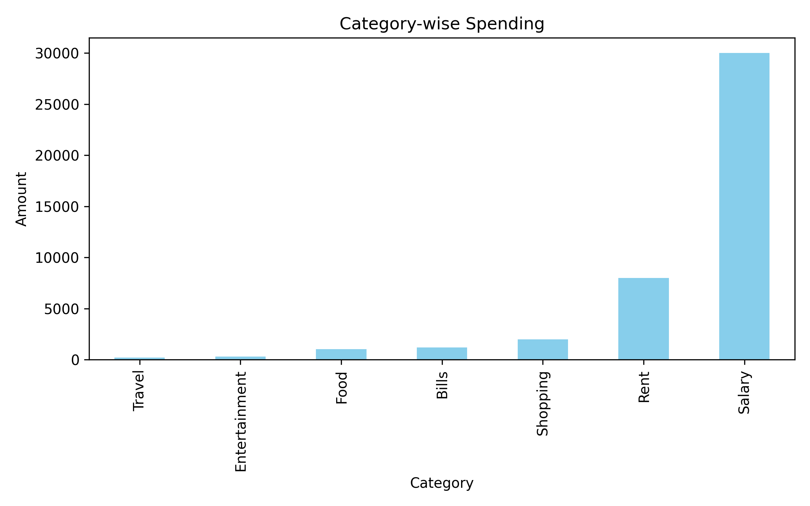
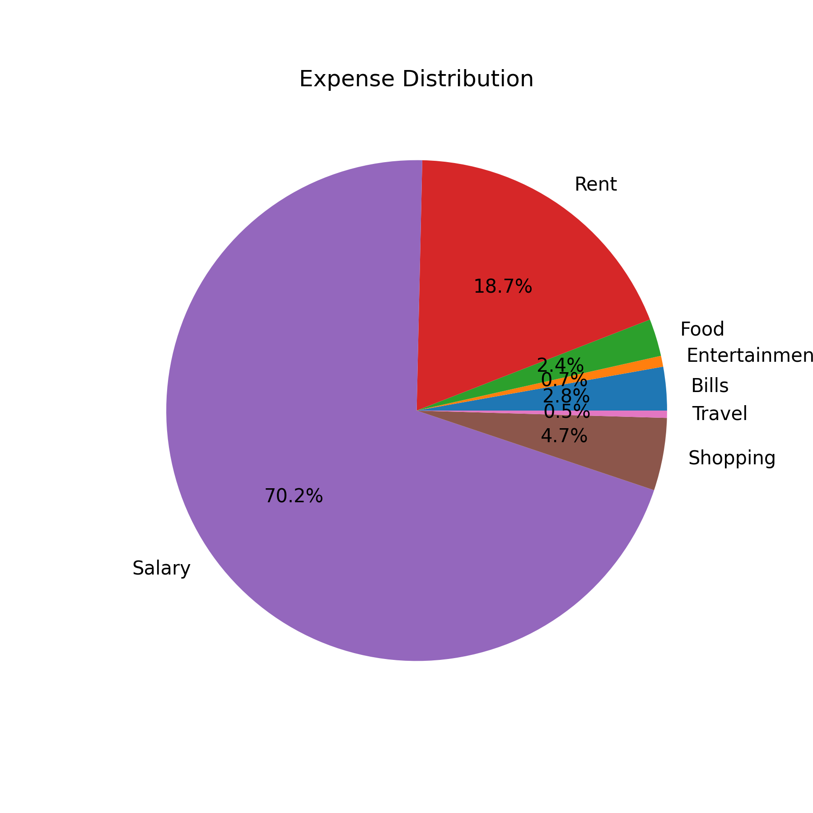
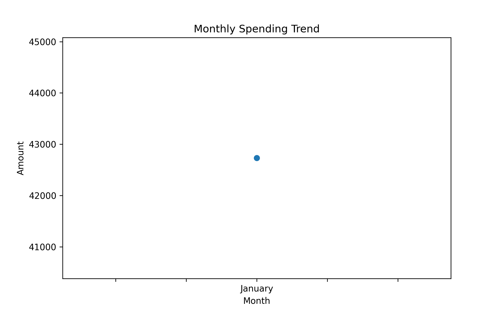

# 💰 Expense Tracker App (Data Science Project)

## 📊 Project Overview
The Expense Tracker App is a data science project designed to track, analyze, and visualize personal or business expenses. It converts raw financial transactions into meaningful insights using Python, helping users understand their spending patterns and improve financial decision-making.

This project simulates real-world FinTech applications such as Google Pay, PhonePe, CRED, Mint, and RazorpayX where expense tracking and analytics are widely used.

---

## 🎯 Objective
The main objectives of this project are:
- Track income and expenses
- Categorize spending automatically
- Analyze financial behavior
- Visualize spending patterns
- Generate actionable insights

---

## 🧠 Problem Statement
People often struggle to track daily expenses, leading to overspending and poor financial planning. This project solves that problem by converting raw financial data into structured insights and visual reports.

---

## ⚙️ Tech Stack
- Python 🐍
- Pandas 📊
- NumPy 🔢
- Matplotlib 📈
- Seaborn 📉
- Streamlit 🌐

---

## 📁 Project Structure
Expense-Tracker-App/
│
├── data/
│   └── expenses.csv
│
├── main.py
├── app.py
├── outputs/
│   ├── category_chart.png
│   ├── pie_chart.png
│   └── monthly_trend.png
├── requirements.txt
└── README.md

---

## 📂 Dataset Description
The dataset contains synthetic expense records with the following columns:
- Date → Transaction date
- Category → Expense type (Food, Travel, Rent, Bills, etc.)
- Description → Transaction details
- Amount → Money spent or earned
- Type → Income or Expense

---

## 🚀 Features
- Data cleaning and preprocessing
- Category-wise expense analysis
- Monthly spending trends
- Income vs expense comparison
- Interactive dashboard using Streamlit
- Automatic insight generation
- Saved visual reports

---

## 📊 Visualizations & Outputs

### 📊 Category-wise Spending

---

### 🥧 Expense Distribution

---

### 📈 Monthly Spending Trend

---

## ▶️ How to Run the Project

### 1️⃣ Install Dependencies
pip install pandas numpy matplotlib seaborn streamlit

---

### 2️⃣ Run Main Analysis
python main.py

---

### 3️⃣ Run Streamlit Dashboard
streamlit run app.py

---

## 📷 Outputs Generated
After execution, the project generates:
- Cleaned dataset
- Console insights
- Saved charts in outputs folder
- Interactive dashboard in browser

---

## 💡 Key Insights
- Highest spending category detection
- Monthly expense trends
- Income vs expense comparison
- Overspending pattern detection
- Budget analysis

---

## 🏢 Real-World Applications
This project is similar to systems used in:
- Google Pay 📱
- PhonePe 💳
- CRED 💰
- Mint 📊
- RazorpayX 🏦
- Splitwise 🤝

These platforms use similar analytics systems for financial tracking and user insights.

---

## 🔮 Future Improvements
- AI-based expense prediction 🤖
- Smart budget alerts 🔔
- Bank API integration 🏦
- Mobile app version 📱
- Real-time tracking ⏱️
- Machine learning classification of expenses

---

## 👨‍💻 Author
This project is developed as a Data Science portfolio project for internships, placements, and academic submission.

---

## ⭐ Support
If you like this project, please give it a ⭐ on GitHub and feel free to enhance it further.